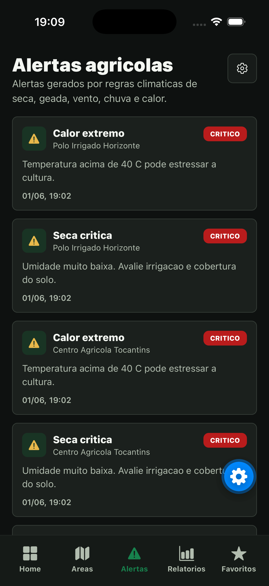
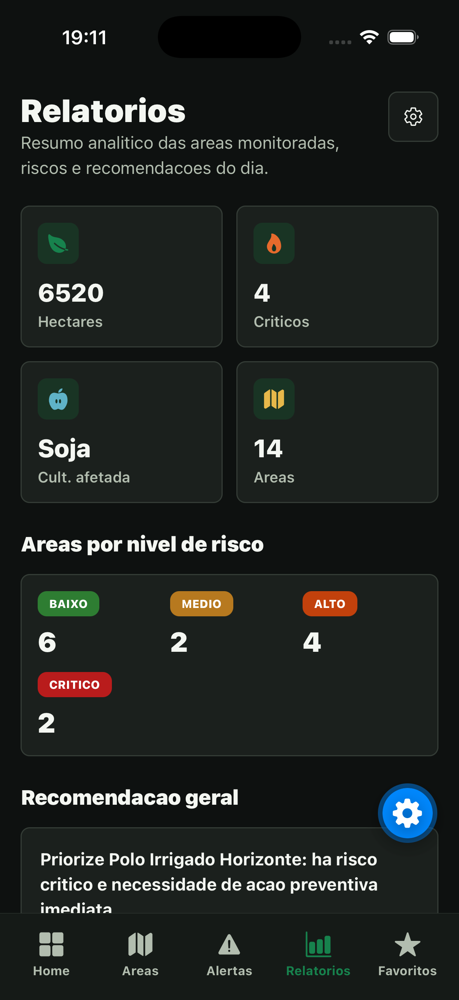
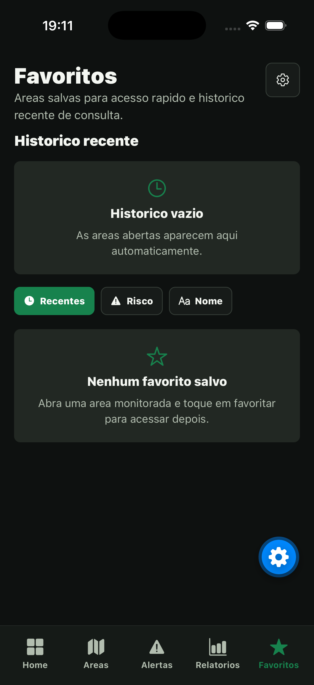
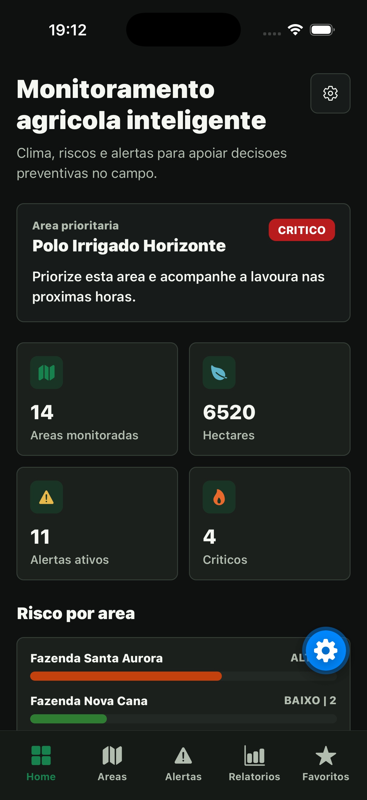
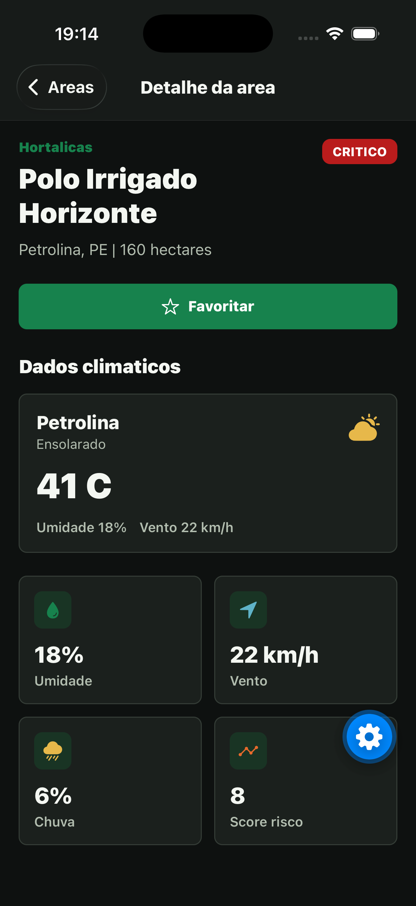

## Integrantes

Pedro Oliveira - 99943
Diego Cabral - 557817
Débora Ivanowski - 555694

# AgroOrbit

Aplicativo mobile desenvolvido em React Native com Expo e TypeScript para monitoramento agricola inteligente. A solucao usa dados climaticos, armazenamento local e conceitos de sensoriamento remoto para apoiar decisoes preventivas no campo.

## Proposta

O AgroOrbit ajuda produtores, cooperativas e gestores rurais a acompanhar condicoes ambientais que impactam a lavoura, como temperatura, umidade, vento, chuva e risco de seca, geada ou calor extremo.

O projeto se conecta a industria espacial porque simula o uso de dados climaticos, monitoramento orbital e sensoriamento remoto aplicados a agricultura sustentavel.

## ODS relacionados

- ODS 2 - Agricultura sustentavel
- ODS 8 - Crescimento economico
- ODS 9 - Industria, inovacao e infraestrutura
- ODS 13 - Acao contra a mudanca global do clima

## Funcionalidades

- Dashboard com indicadores climaticos e area prioritaria
- Graficos de risco por area e resumo de alertas por tipo
- Listagem de areas monitoradas
- Busca por cidade, cultura ou nome da area
- Filtro e ordenacao por nivel de risco
- Tela de detalhe da area com clima, risco, alertas e recomendacoes
- Favoritos salvos localmente com AsyncStorage
- Ordenacao e remocao direta de favoritos
- Historico recente salvo localmente
- Alertas agricolas por regras climaticas
- Notificacoes locais quando uma regiao e salva nos favoritos
- Assistente IA local com recomendacoes baseadas em regras climaticas
- Tela de relatorios com resumo analitico
- Visualizacao de latitude e longitude das areas
- Geolocalizacao para clima e risco da regiao atual
- Mapa visual interativo das areas monitoradas
- Dark mode persistido localmente
- Validacao climatica regional com Open-Meteo por latitude e longitude
- Service Layer com Axios e Fetch API

## Regras de risco

- Temperatura acima de 35 C e umidade abaixo de 30% gera risco alto de seca
- Temperatura acima de 40 C gera risco critico de calor extremo
- Vento acima de 40 km/h gera alerta de vento forte
- Temperatura abaixo de 5 C gera risco de geada
- Umidade abaixo de 20% gera risco critico de seca

Niveis usados no app:

- BAIXO
- MEDIO
- ALTO
- CRITICO

## Areas monitoradas

As areas exibidas no app sao cenarios demonstrativos criados para a apresentacao do projeto. Os nomes das propriedades, culturas associadas, hectares e alguns dados climaticos foram controlados para garantir que o aplicativo mostre todos os niveis de risco, alertas e recomendacoes durante a avaliacao.

O que e real ou baseado em dados reais:

- cidades e estados usados como referencia;
- latitude e longitude aproximadas das regioes;
- consulta da regiao atual por geolocalizacao;
- clima da secao "Minha regiao" via OpenWeatherMap;
- validacao climatica regional por coordenadas via Open-Meteo.

O que e simulado para demonstracao:

- nomes das propriedades, como "Polo Irrigado Horizonte" e "Fazenda Santa Aurora";
- tamanho das areas em hectares;
- culturas associadas a cada propriedade;
- cenarios climaticos das areas monitoradas;
- distribuicao de riscos para exibir baixo, medio, alto e critico.

## Tecnologias

- React Native
- Expo
- TypeScript
- React Navigation
- Bottom Tabs
- Native Stack
- Context API
- Custom Hooks
- AsyncStorage
- Axios
- Fetch API
- Expo Notifications
- Expo Location

## APIs

### OpenWeatherMap

Usada para buscar clima atual quando a variavel `EXPO_PUBLIC_OPENWEATHER_API_KEY` estiver configurada. Sem chave, o app usa dados simulados para continuar funcional.

As areas monitoradas usam cenarios climaticos controlados para demonstrar todos os niveis de risco durante a apresentacao. A secao "Minha regiao" usa clima real por geolocalizacao.

### Open-Meteo

Usada como segunda fonte externa para validar o clima da area prioritaria por coordenadas. Ela nao substitui o clima principal do app; funciona como uma camada complementar de comparacao regional.

Fluxo aplicado no app:

- identifica a area com maior nivel de risco;
- usa a latitude e longitude dessa area;
- busca clima atual real nessa coordenada;
- exibe temperatura, umidade, vento e precipitacao;
- compara os dados externos com os dados climaticos usados pelo app;
- reforca geolocalizacao, API externa e monitoramento climatico.

## Estrutura

```txt
src/
  components/
  contexts/
  data/
  hooks/
  navigation/
  screens/
  services/
  storage/
  theme/
  types/
  utils/
```

## Como executar

Instale as dependencias:

```bash
npm install
```

Crie um arquivo `.env` se quiser usar clima real:

```bash
EXPO_PUBLIC_OPENWEATHER_API_KEY=sua_chave_openweathermap
```

Execute o projeto:

```bash
npm start
```

Executar em cada plataforma:

```bash
npm run android
npm run ios
npm run web
```

## Como testar geolocalizacao no emulador

No iOS Simulator, a localizacao real do computador nao e usada automaticamente. Para simular Sao Paulo:

1. Clique na janela do iOS Simulator para deixa-la ativa.
2. No menu superior do macOS, acesse `Features > Location > Custom Location...`.
3. Informe as coordenadas:

```txt
Latitude: -23.5505
Longitude: -46.6333
```

4. Abra o app e toque em `Usar minha localizacao` na secao `Minha regiao`.

O app deve detectar Sao Paulo e buscar o clima pela OpenWeather usando latitude e longitude. A API pode retornar uma localidade proxima, como Liberdade, porque o clima vem da estacao/regiao mais proxima das coordenadas.

## Imagens do app








